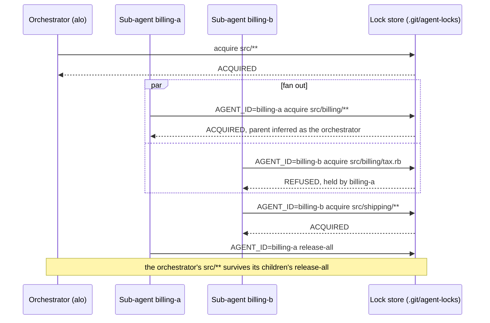

# Agent::Lock

[](https://github.com/kigster/agent-lock/actions/workflows/main.yml)

Advisory file locks for coding agents that share a checkout.

## What it is

`agent-lock` is a gem with one executable, `alo` (also installed as `agent-lock`). An agent runs `alo acquire <scope>` before it writes, and learns in one reply whether anybody else is working there: who, since when, and doing what. It works for separate sessions in one checkout, and for the sub-agents of a single session, which is the harder case.

Git does not help here. Two agents on one branch and one working tree never produce a conflict: the second writer simply wins, and the first one's work is gone without an error anywhere. A lock stops that, but only if every writer can be named reliably, even though an agent harness runs each command in a brand new shell. Making that name stable, and keeping claims correct when several agents ask at the same moment, is most of what this gem does.

## Who it is for

- **People running several coding agents at once** (Claude Code, Codex, Cursor, a terminal of your own) in the same checkout.

- **Orchestrators that fan out sub-agents** into one worktree, each taking a different part of it.

- **Harnesses** that launch agents over a repository and need them to stay out of each other's way.

Not for work that can have a checkout of its own. A git worktree per agent removes the sharing altogether, which is better than coordinating it. The locks are advisory: they protect a file only from agents that check. `--enforce` exists for the few files that must not move at all.

## How to use it

### Install

```bash
gem install agent-lock
alo version        # alo must be on PATH
```

Or add `gem "agent-lock"` to a Gemfile.

### Claim before you write

```bash
alo acquire "lib/billing/**" "rewriting the invoices"   # claim a corner of the tree
alo check   "lib/billing/tax.rb"                        # exits 1 if somebody else holds it
alo note    "lib/billing/**" "totals done, specs red"   # where you are, for whoever comes next
alo list                                                # everything held in this repository
alo release-all                                         # when you are done
```

A refusal tells you who and what, not just that you lost:

```bash
$ alo acquire lib/billing/tax.rb
REFUSED, do not write here
HELD  lib/billing/**  by luke-backend  since 2026-09-09T21:04:11Z
      intent: rewriting the invoices
```

Exit 1 means do not write there. Exit 2 means the command could not run at all.

### Fan out to sub-agents in one worktree

The orchestrator claims the area it hands out, running `alo` bare. Each sub-agent then claims its own part of it, naming itself on every call:

```bash
alo acquire "src/**" "fanning out the billing work"            # orchestrator

AGENT_ID=billing-a alo acquire "src/billing/**" "tax rounding"  # sub-agent A
AGENT_ID=billing-b alo acquire "src/billing/tax.rb" "..."       # sub-agent B: REFUSED, held by billing-a
AGENT_ID=billing-a alo release-all                              # A's own locks, never the orchestrator's
```



Three things matter, and each one fails silently if skipped:

1. **The name goes on every call.** Sub-agents run inside the parent's process and would sign every lock as the parent. Each call is also a fresh shell, so an `export AGENT_ID` from an earlier call is gone. `AGENT_ID=<name> alo whoami` shows the name a lock would be signed with.

1. **Run `alo` in the checkout being written**, with `cd` or `--dir`. A lock in another repository protects nothing.

1. **Sub-agents claim even inside the orchestrator's lock.** The orchestrator's lock keeps other sessions out; only a sub-agent's own claim keeps its siblings out.

### Teach your agents

The gem ships a skill that teaches an agent all of the above, so the rules reach the agents rather than living only in this README. Install it into the skills directory your agent reads:

```bash
alo skill install                    # default: into ~/.agents/skills, for most agents
alo skill install --for claude       # into ~/.claude/skills instead
alo skill install --into some/path   # anywhere else, --for is ignored if both are given
alo skill path                       # where the bundled copy is
```

`install` refuses to overwrite a copy that differs (`--force` replaces it) and never touches a symlink, since a symlink is some other installer's.

If skills on your machine are installed from repositories by a manifest, name this one as a source instead, so the skill is recorded along with where it came from. For example:

```yaml
- name: agent-lock
  type: skills
  repo: git@github.com:kigster/agent-lock.git
  path: skills
```

Then put the rule where every agent reads it, such as `CLAUDE.md` or `AGENTS.md`:

```markdown
Several agents may work in this checkout at once. Before creating or editing
files, load the agent-lock skill and claim the narrowest scope that covers your
writes:

    alo acquire <scope> "<what you are doing>"

If it refuses, work somewhere else. A sub-agent prefixes every call with its
own name: AGENT_ID=<sub-agent-name> alo acquire ... Release with
`alo release-all` when you are done.
```

Advisory locks work because everybody checks. That is why the rule belongs in the instructions your agents load, and not only here.

## How it works

### Identity comes from the session

In order of preference:

| Source              | When it applies                                         |
| :------------------ | :------------------------------------------------------ |
| `AGENT_ID`          | A human or a harness named this session on purpose      |
| `CLAUDE_SESSION_ID` | A harness that exports it, since it survives `--resume` |
| Fingerprint         | Neither of the above is set                             |

The fingerprint walks up from the current process until it finds an ancestor that is not a shell. That is the `claude` or `codex` process driving the session, or the terminal a person is typing in. Its pid, start time, uid and hostname are hashed into a name like `claude-1f4c8a02`, which stays the same for as long as the session lives and differs from anybody else's.

> [!NOTE]
> The start time is in the hash on purpose. Pids get recycled, and a new session that lands on a dead one's number should not inherit its locks.

`alo whoami` prints the name this session would sign a lock with, its parent, and where each came from. Run it before the first claim if in doubt.

### Locks live inside `.git`

The store is `$(git rev-parse --git-common-dir)/agent-locks`.

| Property                                      | Why it matters                                   |
| :-------------------------------------------- | :----------------------------------------------- |
| Git cannot track anything in `.git`           | No repository needs a `.gitignore` entry         |
| `git clean -xdf` cannot reach it              | A cleanup does not silently drop every lock      |
| Every worktree resolves to the same directory | One store serves the whole repository            |
| It is deleted with the checkout               | Nothing outlives the repo in your home directory |

Outside a git repository the store falls back to `~/.agent-locks`, keyed by a digest of the tree.

### A lock is a document, not a flag

```markdown
---
agent_id: luke-backend
scope: workflow/**
status: active
pid: 69232
created_at: 2026-09-09T21:04:11Z
---
rewriting the installer

## Progress
- 2026-09-09T21:14:02Z installer rewritten, specs still red
```

An agent that runs into this learns who holds the scope and what they are doing, so it can decide whether to wait or to work somewhere else. A human can read the same file in an editor.

### Scopes are globs

| Scope         | Means                                              |
| :------------ | :------------------------------------------------- |
| `**`          | The whole tree                                     |
| `workflow/**` | Everything under `workflow`                        |
| `workflow`    | The same thing. A directory means everything in it |
| `lib/cli.rb`  | One file                                           |

Two scopes conflict when either one's fixed part contains the other's. So `workflow/**` conflicts with `workflow/lib/cli.rb`, and `docs/**` does not conflict with `workflow/**`.

> [!TIP]
> The rule deliberately refuses more often than it strictly must. Working out whether two globs can ever match the same path has answers nobody can predict, and the price of guessing wrong is somebody's lost work.

A scope is read from where you stand, globs included, and an absolute path inside the tree is made relative. So `$PWD/lib/**` and `lib/**` are the same claim, and `*.rb` typed in `lib/` is `lib/*.rb`. Only `.`, `*` and `**` mean the whole tree from anywhere. Two things are refused with exit 2 rather than guessed at:

| Scope                        | Why it is refused                                                                                          |
| :--------------------------- | :--------------------------------------------------------------------------------------------------------- |
| `""`                         | Usually an unset variable. Claiming the whole tree by accident blocks everybody; write `**` if you mean it |
| `/etc/passwd`, `../other/**` | Outside the tree, so no lock in this store can protect it                                                  |

### Sub-agents are a family, not one holder

Ownership and blocking are separate questions, and conflating them is what lets sibling sub-agents overwrite each other.

| Relationship            | May claim an overlapping scope                            | Appears in `mine`, can be released |
| :---------------------- | :-------------------------------------------------------- | :--------------------------------- |
| Yourself                | Yes, it is already yours                                  | Yes                                |
| Your parent session     | Yes, inside its claim, and the claim is recorded as yours | No                                 |
| A sub-agent you spawned | No, you handed that scope out                             | Yes, so cleanup takes them with it |
| A sibling sub-agent     | No                                                        | No                                 |

A sub-agent claiming inside its parent's lock gets a lock of its own, and that lock is what keeps its siblings out. Asking for exactly the parent's scope is refused, since that would leave nothing for a sibling to be kept out of; claim something narrower. A sub-agent's `release-all` gives back its own locks and its children's, never its parent's.

#### Sub-agents that share their parent's process

Claude Code runs sub-agents inside the parent's own `claude` process, and sets nothing in the environment that tells them apart. They therefore share the parent's fingerprint, and without help every one of them would sign locks as the parent and none would ever block another.

So a sub-agent names itself, on every call, since each command runs in a fresh shell and an `export` does not survive to the next one:

```bash
AGENT_ID=luke-backend alo whoami                        # id luke-backend, parent claude-1f4c8a02 (inferred)
AGENT_ID=luke-backend alo acquire lib/billing/** "invoices"
AGENT_ID=luke-backend alo release-all
```

When `AGENT_ID` is set and `AGENT_PARENT_ID` is not, the parent is taken to be the session's own name, `CLAUDE_SESSION_ID` if the harness exports it and the fingerprint otherwise, which is the orchestrator running bare `alo`. Set `AGENT_PARENT_ID` explicitly when the parent named itself too.

> [!NOTE]
> The same rule applies in a terminal. Setting `AGENT_ID` there makes the terminal's own session your parent, so a bare `alo` typed in that terminal can release what you claimed under the name.

### A crash does not strand the tree

A lock is cleared out of the way when its holder is provably gone: the process that signed it has exited, on this machine. A holder on another machine cannot be checked, so its lock is trusted until nobody has touched it for `AGENT_LOCK_STALE_MINUTES` (120 by default). Every `note` counts as a touch. What happens next depends on whether anything was written down:

| The lock has | What happens to it                               |
| :----------- | :----------------------------------------------- |
| No notes     | Deleted. There is nothing to come back to        |
| Notes        | Orphaned. The claim is void, the record survives |

```
$ alo acquire workflow/**
INTERRUPTED WORK on workflow/**, left by luke-backend
  alo resume workflow/**   # take it back, notes and all
  alo break workflow/**    # throw it away and start over
```

> [!WARNING]
> An orphan blocks nobody, but `acquire` will not silently overwrite one, because the notes inside it may be the only record of half-finished work. Choose `resume` or `break`.

A live holder's lock is never cleared, however old it is. An agent may legitimately work on one scope for hours, and deleting its lock underneath it would hand its files to the next agent while it is still writing them. Past the stale window `list`, `check` and `mine` tag it `STALE` instead, and taking it is a `break` that somebody announces first.

```
$ alo list
Locks held (2):
app/**	orchestrator	2026-09-11T16:04:56Z
  fanning out
docs/**	slow-agent	2026-09-11T13:04:55Z	STALE
  rewriting the guides
Interrupted (1):
db/**	crashed-agent	2026-09-11T15:54:55Z	INTERRUPTED
  splitting the migrations
```

Only live claims are counted as held. `--json` gives every record its `status` and a `stale` flag.

## Commands

| Command                    | Does                                                   | Exit code                                              |
| :------------------------- | :----------------------------------------------------- | :----------------------------------------------------- |
| `acquire <scope> [intent]` | Claim a scope                                          | 1 if held, interrupted, or exactly your parent's scope |
| `release <scope>`          | Give it back                                           | 1 if it belongs to somebody else                       |
| `check <scope>`            | Report who holds it                                    | 1 if held by another session                           |
| `note <scope> <text>`      | Record progress inside a lock you hold                 | 1 if you do not hold it                                |
| `resume <scope>`           | Take back work a crash interrupted                     | 1 if there is nothing to resume                        |
| `list`                     | Every lock in the store                                | 0                                                      |
| `mine`                     | What this session and its sub-agents hold              | 0                                                      |
| `release-all`              | Everything this session and its sub-agents hold        | 0                                                      |
| `break <scope>`            | Take a live lock away from its holder                  | 0                                                      |
| `whoami`                   | The name this session signs locks with, and its parent | 0                                                      |
| `skill install`            | Copy the bundled skill into a skills directory         | 1 if a different copy or a symlink is there            |
| `skill path`               | Where the bundled skill is                             | 0                                                      |
| `completion bash\|zsh`     | Print a shell completion script                        | 1 for any other shell                                  |

Flags:

| Flag         | Where                             | Does                                    |
| :----------- | :-------------------------------- | :-------------------------------------- |
| `--json`     | `check`, `list`, `mine`, `whoami` | Machine-readable output                 |
| `--dir PATH` | Everywhere                        | Work as if run from `PATH`              |
| `--enforce`  | `acquire`                         | Also make the matched files unwritable  |
| `--force`    | `acquire`                         | Permit `--enforce` on a very wide scope |

Any command exits 2 when it cannot run at all: a scope that is empty or outside the tree, a backend mismatch, or a store it cannot reach.

## Shell completion

```bash
alo completion bash > "$(brew --prefix)/etc/bash_completion.d/alo"
alo completion zsh  > "${fpath[1]}/_alo"
```

Names every command and flag `alo` currently knows, since the script is generated from the same registry the CLI runs, rather than hand-maintained separately from it.

## Configuration

| Variable                   | Default                                 | Does                                                                     |
| :------------------------- | :-------------------------------------- | :----------------------------------------------------------------------- |
| `AGENT_ID`                 | fingerprint                             | Name this session yourself                                               |
| `AGENT_PARENT_ID`          | the fingerprint, when `AGENT_ID` is set | The session that spawned this one                                        |
| `AGENT_LOCK_DIR`           | `.git/agent-locks`                      | Keep locks somewhere else                                                |
| `AGENT_LOCK_STALE_MINUTES` | `120`                                   | When a lock is tagged `STALE`, and when one from another machine expires |
| `AGENT_LOCK_MUTEX_TIMEOUT` | `15`                                    | Seconds a claim waits for the store's mutex before giving up with exit 2 |
| `AGENT_LOCK_BACKEND`       | `redis` if one answers, else `file`     | `file` or `redis`                                                        |
| `AGENT_LOCK_TTL_SECONDS`   | `0`                                     | Redis expiry. `0` means no TTL                                           |
| `REDIS_URL`                | `redis://127.0.0.1:6379/0`              | Where Redis is                                                           |

## Backends

Redis stores the same documents as the file store, and buys two things a filesystem cannot: its mutex holds across machines, and a TTL expires an abandoned lock without anybody having to reason about liveness. A tree defaults to Redis when one answers on `REDIS_URL`, and falls back to the file store, which needs nothing installed, when none does.

```bash
AGENT_LOCK_BACKEND=redis alo acquire workflow/**   # force it, rather than autodetect
AGENT_LOCK_BACKEND=file  alo acquire workflow/**   # or force the file store instead
```

Either way, every claim checks for conflicts and writes its lock while holding one mutex for the whole store. Refusing an atomic write of an identical scope is not enough on its own: `lib/**` and `lib/cli.rb` are different keys, and two agents claiming them at the same moment would both find the store empty and both win. The file store takes an exclusive `flock` on `.mutex` beside the locks. Redis takes `agent-lock-mutex:<tree digest>` with `SET NX PX` and a random token, and gives it back with a compare-and-delete script, so a process whose lease ran out cannot release somebody else's.

> [!CAUTION]
> Picking a default from whether Redis happens to answer is still never a runtime auto-*switch*. If one agent found a running Redis and switched to it while the agent beside it did not, the two would take locks in different stores, see nothing of each other, and both report success — worse than no lock at all. The first store created in a tree records which backend it is, in a marker file, and every later process in that tree is bound to it regardless of what Redis is doing next; a mismatch stops the run rather than silently picking the other one.
>
> That default is decided at the one moment two processes could otherwise race: both find a virgin tree, both probe Redis, and a flaky answer could hand them different defaults before either writes the marker. The marker is claimed atomically — the first `O_CREAT|O_EXCL` wins — and every process builds from whatever ends up on disk, never from its own guess, so a race can land on either backend but never on a split.

The `redis` gem ships as a dependency of this one now, since deciding the default means probing for it. If you never want that probe, or never install a local Redis, set `AGENT_LOCK_BACKEND=file` yourself.

## Freezing files, on macOS

`acquire --enforce` also runs `chflags uchg` on every matched file, which makes them unwritable by anything, whether it checks for locks or not.

```bash
alo acquire "config/credentials/**" "keys must not move during the migration" --enforce
```

> [!WARNING]
> This is opt-in for three reasons. It is macOS only, since the Linux equivalent (`chattr +i`) requires root. It denies the holder too, so it suits a freeze rather than a file you are editing. And a session that dies leaves the files frozen, at which point `git checkout` and `rm -rf` start failing with "Operation not permitted".
>
> Every frozen path is written into the lock, so `release` and `break` thaw them without needing the process that froze them to still exist.

## Development

```bash
bin/setup
bundle exec rspec                              # 228 examples, against the file backend
AGENT_LOCK_TEST_BACKEND=redis bundle exec rspec # the same suite, against Redis instead
bundle exec rubocop
```

The suite runs against one backend at a time, picked by `AGENT_LOCK_TEST_BACKEND` rather than the machine's own default, so it stays deterministic whether or not Redis happens to be running: only the examples that test one backend's own on-disk or on-Redis shape care which one that is, and a Redis run defaults to database 15 so it never touches whatever database a developer's own Redis work lives in. CI runs both, plus rubocop as a third, independent job.

A `justfile` covers the rest: `just test`, `just test-coverage`, `just ci` (rubocop then coverage), `just format` (autocorrect, then regenerate `.rubocop_todo.yml`), and `just publish`/`just release` for cutting a version. `just lint` currently names `standardrb`, which is not one of this gem's dependencies; use `bundle exec rubocop` until that recipe is reconciled with the rest of the project's tooling.

The library decides and the CLI prints. Every verb is a method on `Manager` that returns a result and prints nothing, so the whole lifecycle can be tested without capturing output. `Launcher` takes `argv`, `stdin`, `stdout`, `stderr` and `kernel` as arguments, and nothing below it calls `puts` or a receiverless `exit`, which is what lets Aruba run the CLI end to end inside the test process instead of forking a Ruby per example.

## License

MIT

## Authors

- Konstantin Gredeskoul @kigster
- Claude Code, @claude
