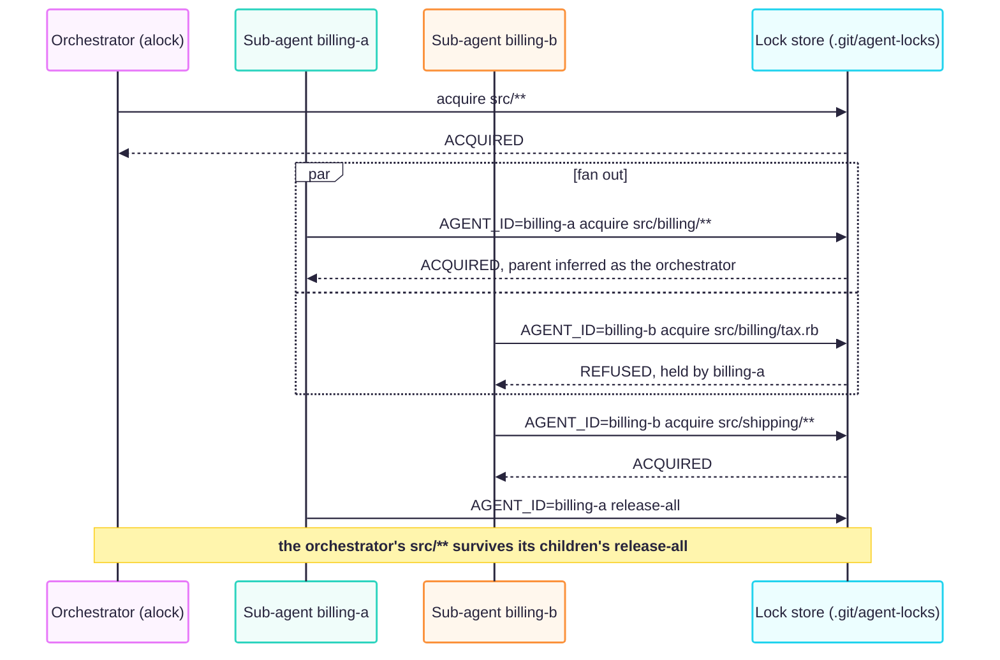

# Sequence Diagram of Agent Lock Locking

```mermaid
---
config:
  layout: elk
  look: handrawn
  fontFamily: Open Sans Variable, sans-serif
  theme: redux-color
---
sequenceDiagram
  participant O as Orchestrator (alock)
  participant A as Sub-agent billing-a
  participant B as Sub-agent billing-b
  participant S as Lock store (.git/agent-locks)
  O->>S: acquire src/**
  S-->>O: ACQUIRED
  par fan out
    A->>S: AGENT_ID=billing-a acquire src/billing/**
    S-->>A: ACQUIRED, parent inferred as the orchestrator
  and
    B->>S: AGENT_ID=billing-b acquire src/billing/tax.rb
    S-->>B: REFUSED, held by billing-a
  end
  B->>S: AGENT_ID=billing-b acquire src/shipping/**
  S-->>B: ACQUIRED
  A->>S: AGENT_ID=billing-a release-all
  Note over O,S: the orchestrator's src/** survives its children's release-all
```